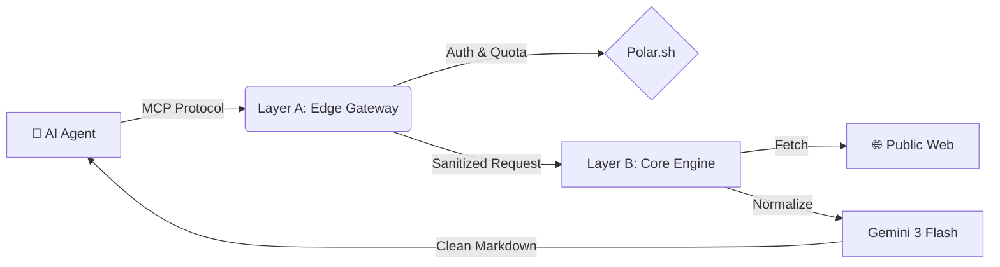

# 🏴‍☠️ Agent-Commerce-Gateway (Edge Layer)


> **High-performance MCP-SSE proxy and Data Normalization Layer for Project GHOST SHIP.**

**Agent-Commerce-Gateway** is the secure "Edge Layer" (Layer A) of the Project GHOST SHIP infrastructure. Running on Cloudflare Workers, it acts as the protocol translator and governance point that converts raw web data into **LLM-optimized Markdown and structured JSON**.

---

## 🛡️ Role in Infrastructure

We employ a **Zero-Trust Hybrid Architecture** to ensure speed, security, and scalability.



* **Protocol Routing**: Aggregates MCP-over-SSE and REST requests into a unified stream.
* **Data Normalization**: Filters out web noise (ads, tracking) before data reaches the agent.
* **API Governance**: Manages usage quotas via Polar.sh (Metered Billing).

---

## 🛠️ Tech Stack (Edge Specifications)

* **Runtime**: Cloudflare Workers (TypeScript)
* **Framework**: Hono - Fast, lightweight web standard.
* **Protocol**: MCP (Model Context Protocol) over SSE.
* **Security**: Strict CORS & Headers (`X-Internal-Secret`) for Layer B communication.

---

## ⚡ Quick Start

### Install dependencies
```bash
npm install
```

### Local development
```bash
npm run dev
```

### Deploy to production
```bash
npx wrangler deploy --env production
```

---

## 🤖 Discovery for Agents

* **Interactive Docs (Swagger)**: Human-readable API specs at [https://api.sakutto.works/docs](https://api.sakutto.works/docs).
* **Discovery Endpoint**: Technical specs are hosted at [https://api.sakutto.works/llms.txt](https://api.sakutto.works/llms.txt).
* **MCP Server Definition**: Automated discovery at [https://api.sakutto.works/.well-known/mcp.json](https://api.sakutto.works/.well-known/mcp.json).

---

## ⚖️ Legal & Compliance

This service is a pure data processing infrastructure, **NOT** an advisory service.  
Please read our `LEGAL.md` carefully.

* We do **NOT** provide analytical predictions, automated decision-making, or specialized advisory.
* We do **NOT** maintain proprietary databases or closed-source intelligence feeds.
* The "Commerce" in our name refers strictly to our API Metered Billing Infrastructure for developers.

---

## 🔗 Architecture Links

* **agent-commerce-core** - The Normalization Engine (Layer B).
* **Polar.sh** - Subscription & Quota Management.

© 2026 Sakutto Works - Enabling Secure Data Governance for AI.
