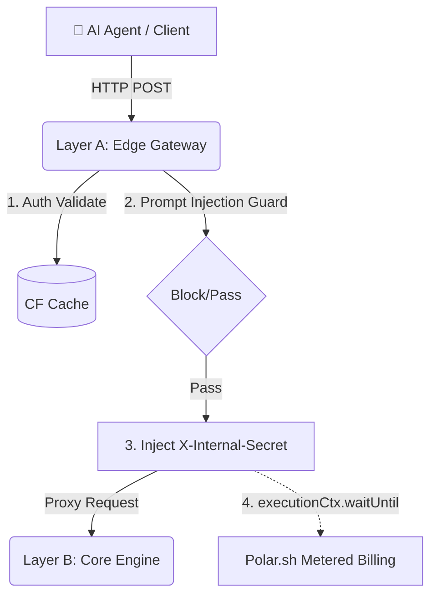

# 🏴‍☠️ Agent-Commerce-Gateway (Layer A: Edge Gateway)


[](https://buy.polar.sh/polar_cl_mps3G1hmCTmQWDYYEMY2G1c7sojN3Tul6IhjO4EtVuj)
[](https://github.com/sponsors/SakuttoWorks)

> **High-performance HTTP Proxy and Defense-in-Depth Edge Layer for Project GHOST SHIP.**

**Architecture Scope:** Project GHOST SHIP is built on a unified three-tier architecture: **Layer A** (Edge Gateway), **Layer B** (Core Engine), and **Layer C** (MCP Server). This repository contains **Layer A**. It performs zero data processing; instead, it serves exclusively as the perimeter defense, authentication verifier, and billing interceptor before routing secure traffic to the internal normalization engine.

---

## ✨ Core Features
* **AI Agent Ready:** Native support for Model Context Protocol (MCP) tool discovery and API key authentication.
* **Zero-Trust Edge Security:** Actively blocks Prompt Injection attempts (e.g., `ignore previous instructions`) before they hit the core engine.
* **Metered Billing Integration:** Seamless integration with Polar.sh for latency-free, asynchronous usage tracking.
* **Privacy-First Audit Logging:** Masks PII (Personally Identifiable Information) natively at the edge and securely stores logs in Cloudflare R2.
* **High Availability:** Built on Cloudflare Workers with Smart Placement for minimal latency routing to Google Cloud Run.

---

## 🛡️ Role in Infrastructure (Defense in Depth)

We employ a **Zero-Trust Hybrid Architecture** to ensure speed, security, and scalability. The Edge Gateway (Layer A) enforces a strict perimeter defense by actively authenticating requests and rejecting unauthorized traffic. Only fully validated requests are enriched with `X-Internal-Secret` and `X-Tenant-Id` headers before being securely proxied to the Core Engine (Layer B), which drops any direct traffic lacking these internal signatures.



---

## 💸 Asynchronous Metered Billing
Billing is handled natively at the edge, ensuring zero latency overhead for AI agent requests.

* **Validation:** Extracts the API key from the `Authorization: Bearer` header and verifies it via Polar.sh (or the internal Edge Cache).
* **Proxy Routing:** Securely forwards the validated request to Layer B.
* **Event Ingestion:** Leverages Cloudflare's `executionCtx.waitUntil()` to asynchronously dispatch an `api_request` event to the Polar.sh API.
* **Resilience:** In the event of a billing telemetry failure, the agent still receives the normalized data, guaranteeing 100% user-facing uptime.

---

## 🧪 End-to-End Observability & Audit Logs
The infrastructure maintains strict privacy-safe logging to R2 buckets, ensuring full observability while adhering to data protection standards. It has undergone rigorous manual security and functional validation.

### ✅ Normal Traffic (200 OK)
Successfully validates the Polar.sh key, appends Zero-Trust headers, proxies to Layer B, and logs the execution.

```json
{
  "timestamp": "2026-03-XXT10:00:00Z",
  "level": "INFO",
  "event": "proxy_success",
  "tenant_id": "8f3a...291b",
  "status": 200,
  "billing_event": "queued"
}
```

---

## 🚫 Prompt Injection Guard (403 Forbidden)
Successfully intercepts and drops malicious payloads (e.g., "ignore previous instructions") at the edge. This ensures zero compute cost and zero load on Layer B for non-compliant requests.

### 🛑 Blocked Traffic (403 Forbidden)
```json
{
  "timestamp": "2026-03-XXT10:05:12Z",
  "level": "WARN",
  "event": "security_violation",
  "reason": "Prompt Injection Attempt Blocked",
  "tenant_id": "anonymous_tenant",
  "status": 403
}
```

---

## 💻 API Usage Example
Once deployed, or when using the official managed endpoint, you must pass your Polar.sh API key as a Bearer token to bypass the Edge Gateway defense.

```bash
curl -X POST "https://api.sakutto.works/v1/normalize_web_data" \
     -H "Authorization: Bearer <YOUR_POLAR_API_KEY>" \
     -H "Content-Type: application/json" \
     -d '{"url": "https://sakutto.works", "format_type": "markdown"}'
```

---

## 🛠️ Tech Stack (Edge Specifications)
* **Runtime:** Cloudflare Workers (TypeScript)
* **Framework:** Hono
* **Protocol:** HTTP Proxy (MCP Compatible)
* **Security:** Prompt Injection Shield, R2 Privacy-Safe Audit Logging, Strict CORS.

---

## 📑 Table of Contents
- [Core Features](#-core-features)
- [Role in Infrastructure (Defense in Depth)](#️-role-in-infrastructure-defense-in-depth)
- [Asynchronous Metered Billing](#-asynchronous-metered-billing)
- [End-to-End Observability & Audit Logs](#-end-to-end-observability--audit-logs)
- [Prompt Injection Guard (403 Forbidden)](#-prompt-injection-guard-403-forbidden)
- [Tech Stack (Edge Specifications)](#️-tech-stack-edge-specifications)

---

## ⚡ Quick Start

### Prerequisites
- **Node.js**: >= 18.0.0
- **Wrangler CLI**: Installed globally (`npm install -g wrangler`)

### 1. Install Dependencies
```bash
npm install
```

### Environment Variables & Secrets

Configuration is split between public environment variables (configured directly in `wrangler.toml`) and secure secrets (managed via `.dev.vars` for local development or Cloudflare Secrets for production).

**1. Public Variables (`wrangler.toml`)**
| Variable | Description |
| :--- | :--- |
| `CORE_API_URL` | The target base URL for the Layer B Core Engine (e.g., Google Cloud Run). |
| `ENVIRONMENT` | The execution environment context (e.g., `production`). |
| `POLAR_ORGANIZATION_ID` | Your Polar.sh Organization ID. |
| `POLAR_PRODUCT_ID` | Your Polar.sh Product ID for metered billing integration. |

**2. Secure Secrets (`.dev.vars` / Cloudflare Secrets)**
| Variable | Description |
| :--- | :--- |
| `INTERNAL_AUTH_SECRET` | Shared secret for securely authenticating Edge (Layer A) to Core (Layer B). |
| `RESEND_API_KEY` | API key for dispatching asynchronous admin security alerts via Resend. |
| `POLAR_ACCESS_TOKEN` | Polar.sh API Token for validating licenses and ingesting billing events. |

### 2. Local Development & Infrastructure Setup

**Step 2a: Create an R2 Bucket (Required for Audit Logs)**
Before running or deploying, you must create the R2 bucket defined in `wrangler.toml`:
```bash
npx wrangler r2 bucket create ghost-ship-logs
```

**Step 2b: Configure Secrets**
Create a `.dev.vars` file in the root directory. You must supply the following required secrets to mirror the production environment:
```ini
INTERNAL_AUTH_SECRET="your_core_auth_secret"
RESEND_API_KEY="your_resend_key"
POLAR_ACCESS_TOKEN="your_polar_token"
```

**Start the local development server:**
```bash
npm run dev
```

### 3. Deploy to Production
Ensure your Cloudflare Workers secrets are securely set via the Cloudflare Dashboard or by using `npx wrangler secret put <KEY>`, then deploy using the predefined npm script:
```bash
npm run deploy
```

---

## 🤝 Contributing
We welcome contributions from the global open-source community! 

### How to Contribute
1. **Fork the Repository:** Create your own branch (`feature/your-feature` or `fix/your-fix`).
2. **Local Testing:** Ensure you have tested your changes locally using the Cloudflare Workers Edge environment (`npm run dev`).
3. **Commit Standards:** Write clear, concise commit messages.
4. **Submit a PR:** Open a Pull Request against the `main` branch with a detailed description of your changes.

For major architectural changes, please open an Issue first to discuss your proposal with the core maintainers.

---

## 🤖 Discovery for Agents

* **Interactive Docs (Swagger)**: Human-readable API specs at [https://api.sakutto.works/docs](https://api.sakutto.works/docs).
* **Discovery Endpoint**: Technical specs are hosted at [https://api.sakutto.works/llms.txt](https://api.sakutto.works/llms.txt).
* **MCP Server Definition**: Automated discovery at [https://api.sakutto.works/.well-known/mcp.json](https://api.sakutto.works/.well-known/mcp.json).

---

## ⚖️ Legal & Compliance
This service is a pure data processing infrastructure, **NOT** an advisory service.  
Please read our [LEGAL.md](LEGAL.md) carefully.

* We do **NOT** provide analytical predictions, automated decision-making, or specialized advisory.
* We do **NOT** maintain proprietary databases or closed-source intelligence feeds.
* The "Commerce" in our name refers strictly to our API Metered Billing Infrastructure for developers.

---

## 🔗 Ecosystem & Architecture Links
* [Official Portal](https://sakutto.works) - Documentation & Discovery Hub.
* [SakuttoWorks GitHub Profile](https://github.com/SakuttoWorks/SakuttoWorks) - Maintainer Profile & Organization Info.
* [agent-commerce-portal](https://github.com/SakuttoWorks/agent-commerce-portal) - Portal Source Code.
* [agent-commerce-gateway](https://github.com/SakuttoWorks/agent-commerce-gateway) - This Repository (Layer A: Edge Gateway).
* [agent-commerce-core](https://github.com/SakuttoWorks/agent-commerce-core) - Data Normalization Engine (Layer B).
* [ghost-ship-mcp-server](https://github.com/SakuttoWorks/ghost-ship-mcp-server) - Official MCP Server (Layer C).
* [Get API Key (Polar.sh)](https://buy.polar.sh/polar_cl_mps3G1hmCTmQWDYYEMY2G1c7sojN3Tul6IhjO4EtVuj) - Quota Purchase & API Key Generation.

---

## 💖 Support the Project

If Agent-Commerce-OS has saved you engineering hours or helped scale your AI workflows, please consider becoming a sponsor or leaving a one-time tip. Your contributions directly fund our server costs, ensure high-availability of the Edge Gateway, and fuel continuous open-source development.

[](https://buy.polar.sh/polar_cl_ZI9H5fL8dQqcormOadiGDFDpS2Sxd1jT05jTX1vStWi)
[](https://github.com/sponsors/SakuttoWorks)


© 2026 Sakutto Works - *Standardizing the Semantic Web for Agents.*

---

## 📄 License

This project is open-source and licensed under the [MIT License](LICENSE).